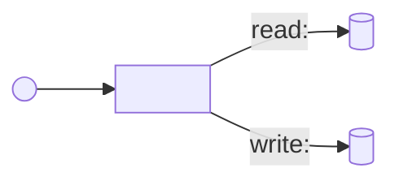

# Effects Diagram

## 2. Concept spec: “Effects Diagram”

### 2.1. Intention

An effects diagram is used to capture the observable behavior of a system through its interactions with the environment.
Observable behavior here means the chain “event → operation → effects on resources.”

The diagram replaces the informal mental effort of “keeping dependencies and side effects in one’s head” with a verifiable model.
The result is used to clarify requirements, estimate scope, plan implementation order, and verify changes for behavioral regressions.

### 2.2. Ontological status

An effects diagram is a behavioral model of the system represented as a directed graph and formalized as an artifact (file/document).
The model describes only what the system reads/writes/sends to external resources and which external signals trigger it.

An effects diagram is not:

* a description of internal classes, modules, and their dependencies;
* a description of call order or step-by-step execution inside an operation;
* a data model with entity attributes and relationships;
* a process diagram of user or business steps.

### 2.3. Invariants of the concept

An effects diagram remains an “effects diagram” if all of the following hold.

* **The system boundary is defined.**
  The diagram explicitly states what is considered “the system” and what is considered “the environment” within the current scope.

* **Operations describe intentions, not implementation.**
  An operation is a named unit of behavior that the system performs as a whole in response to an external signal.

* **Resources represent the environment through state or an external interface.**
  A resource is a named area of mutable state or an external interface (API) accessed by multiple operations and/or existing longer than a single operation.

* **Effects connect operations and resources.**
  An effect is an atomic interaction between an operation and a resource, classified as either read or write.

* **Effects describe “what happens outside,” not “how it is implemented internally.”**
  If an interaction is not observable at the system boundary and is not tied to a resource, it does not need to appear in the diagram.

* **The model is integrity-checkable.**
  For every effect, the operation, resource, and effect type (read/write) are defined.

### 2.4. Minimal notation

The minimal notation defines node types, edge types, and required fields.
It is sufficient for constructing and machine-validating the diagram without committing to a specific visual style.

In this document, `API` means an external resource interface, i.e., a set of read/write operations available to the system.

#### Node types

* **Event (`Event`)** — a type of external signal that triggers an operation.
  Recognition in requirements: phrases like “when …”, “on schedule …”, “upon receiving …”.
  In code: entry points invoked by the framework/platform (HTTP handler, queue consumer, scheduler, CLI command).
  Required fields: `name`.
  Optional fields: `source`, `notes`, `trace`.

* **Operation (`Operation`)** — a named unit of system behavior executed in response to an event and defined by its set of effects.
  Recognition in requirements: “the system must …” with a verb-based outcome.
  In code: an application-level method/function orchestrating access to resources.
  Required fields: `name`.
  Optional fields: `goal`, `notes`, `trace`.

* **Resource (`Resource`)** — a named area of mutable state or external interface (API) with which operations interact.
  Recognition in requirements: storages, integrations, queues/topics, files, caches, external services.
  In code: classes/modules encapsulating state or external API access (repository, external client, message producer).
  Required fields: `name`.
  Optional fields: `kind`, `notes`, `trace`.

#### Edge types

* **Trigger (`Trigger`)**: `Event → Operation`
  Semantics: when the event occurs, the operation must start (once or multiple times, depending on processing policy).
  Required fields: `event`, `operation`.

* **Effect (`Effect`)**: `Operation → Resource`
  Semantics: the operation interacts with the resource.

  Effect types:

  * `read` — the operation reads data without modifying resource state;
  * `write` — the operation changes resource state or sends data that alters the external world.

  Required fields: `operation`, `resource`, `kind` (`read|write`).
  Optional fields: `data`, `condition`, `trace`.

#### Required and optional elements

A minimally valid diagram contains:

* at least one operation;
* at least one resource;
* at least one `Operation → Resource` effect.

Events and triggers are required if the diagram is used to analyze system inputs or validate requirements.
Events may be omitted if the goal is to analyze or decompose already known operations by their effects.

#### Canonical textual format (for AI)

To enable automatic construction and validation by an agent, the diagram should be stored in text form (YAML or JSON) using the following minimal template.

```yaml
system: "<system/subsystem name>"
scope: "<system boundary and assumptions, 1–3 sentences>"

events: # optional
  - name: "<event>"
    source: "<source, optional>"
    trace: ["<requirement/code reference, optional>"]

operations:
  - name: "<operation>"
    goal: "<external outcome, optional>"
    trace: ["<requirement/code reference, optional>"]

resources:
  - name: "<resource>"
    kind: "<resource type, optional>"
    trace: ["<requirement/code reference, optional>"]

triggers: # optional
  - event: "<event.name>"
    operation: "<operation.name>"

effects:
  - operation: "<operation.name>"
    resource: "<resource.name>"
    kind: read|write
    data: "<what is read/written, optional>"
    condition: "<condition, optional>"
    trace: ["<requirement/code reference, optional>"]
```

#### Derived visual representation (for humans)

The textual model (YAML/JSON) is the source of truth.
The visual diagram is a derived representation and may be redrawn without changing meaning.

Default visualization rules (Mermaid `flowchart`):

* `Event` as a circle: `E((...))`
* `Operation` as a rectangle: `O[...]`
* `Resource` as a datastore: `R[(...)]`
* `Trigger`: `Event --> Operation`
* `Effect`: `Operation --> Resource` labeled `read`/`write` (and optionally `data`)

Minimal Mermaid template:



### 2.5. Construction algorithm

The algorithm is defined as a sequence of verifiable steps.
It applies both to building a diagram from requirements and to reverse-engineering it from code.

1. Fix the boundary.
   Define `system` and `scope`. Explicitly list what counts as environment (storages, external services, time, users).

2. Collect inputs (events).
   List `events` as signal types that may trigger system behavior.
   For each event, define at least one target operation or mark as `TBD`.

3. Collect operations.
   List `operations` as “what the system does in response to an event.”
   Validation: each operation is formulated as verb + object (e.g., “Update …”, “Issue …”, “Send …”).

4. Collect resources.
   List `resources` as “what the system reads/writes/calls.”
   Validation: each resource must represent a distinct state domain or external API.

5. Build effects.
   For each operation, list its `effects` as (resource, `read|write`) pairs with minimal `data` labels.
   Validation: each operation has at least one effect, unless explicitly marked as purely computational and excluded.

6. Build triggers.
   For each event, add `triggers` to operations that start in response.
   Validation: each input event has at least one trigger.

7. Normalize names and remove duplicates.
   Merge identical resources/operations differing only by implementation detail.
   Split a resource if it contains independent state domains with different lifecycles.

8. Validate invariants.
   Ensure no orphan effects exist, no undefined effect types are used, and `scope` is consistent.

9. Record uncertainties.
   Move all `TBD`/`?` into a question list and into `notes`/`trace`.

### 2.6. Typical errors (anti-patterns)

This list is used by the agent in two modes:
first as a self-check (errors must be fixed automatically when possible),
and second as user feedback only when clarification or scope decisions are required.

* **System boundary erased.**
  Symptom: internal classes and external services appear together without a clear boundary.
  Message: define `scope`, otherwise effects/resources are indistinguishable from implementation.

* **Operations too granular (helper-level).**
  Symptom: dozens of operations without independent external goals.
  Message: raise operations to intention-level behavior triggered by events.

* **Operations too coarse (“system does everything”).**
  Symptom: 1–2 operations with all effects attached.
  Message: split by distinct intentions to make estimation and planning possible.

* **Resource describes computation, not state/API.**
  Symptom: resources named “Validation,” “Mapping,” “Business Logic.”
  Message: resource must represent state or external API.

* **Read and write not distinguished.**
  Symptom: effects lack `kind` or all use a single type.
  Message: classify effects as `read` or `write` to enable regression analysis.

* **Events missing where required.**
  Symptom: unclear how operations start.
  Message: add `events`/`triggers` to show what the system reacts to.

* **Internal calls modeled as effects.**
  Symptom: “resource” equals internal module/class name without state.
  Message: an effect is interaction with environmental resources, not a function call.

* **Operation writes to multiple independent resources without explicit reason.**
  Symptom: 2+ `write` effects to resources with different lifecycles.
  Message: verify necessity, transactional requirements, and decoupling options.

---

## 3. Skill spec: using the effects diagram by an AI agent

This section describes the tool-level skill: how the agent applies the concept.
Concrete local workflow skills are defined in:

* `skills/effects-diagram-reverse-from-code/SKILL.md`
* `skills/effects-diagram-update-from-requirements/SKILL.md`

### 3.1. Usage triggers

The agent should propose building/updating an effects diagram if at least one condition holds:

* the user describes system behavior in terms of integrations, storages, and events (“when … arrives, we need to …”);
* work estimation or implementation planning is required;
* decomposition by state boundaries and dependencies is needed;
* a complex refactoring/change requires explicit fixation of “what must not change”;
* expectations diverge from results and changed effects must be localized.

The agent should not propose it if:

* the task involves no external resources (pure computation);
* the change is obviously small and regression risk is low;
* an up-to-date diagram of sufficient granularity already exists and covers the discussed scope.

### 3.2. Questions to the user

The agent must first build a draft diagram from available input (requirements, code, existing diagram).
Questions are used only to fix the `scope` boundary and resolve uncertainties that cannot be inferred.

If an answer can be derived from the input, the agent must do so and present a draft for confirmation.

Questions are asked in this order.
If unknown, mark as `TBD` and proceed.

1. What is the system within this diagram (name and `scope` boundary)?
2. What input sources should be used (requirements, code, existing diagram), and where are they located?
3. Which effects are forbidden or critical for regressions (what must not happen)?
4. After drafting: confirm or correct `TBD` items for events, resources, and `write` effects, including consistency requirements (must they occur together or not at all?).

### 3.3. Quality criteria

The diagram is “good enough” if all criteria below are satisfied.

* **Integrity.**
  No orphan effects, every effect has `kind`, `scope` is consistent.

* **Input coverage.**
  All declared input events have triggers, and every input operation has resource effects.

* **Observability.**
  For each `write` effect, the changed external outcome is clear (at minimum via `resource` and `data`).

* **Minimality for purpose.**
  The diagram excludes implementation details irrelevant to the discussed behavior.

* **Explicit uncertainty.**
  All gaps are marked as `TBD` with questions, not silent assumptions.

Work must continue if:

* key effects/resources/events remain `TBD`;
* an operation has disputed multiple `write` effects without justification;
* operation/resource names are unstable and change with each clarification (normalization required).
