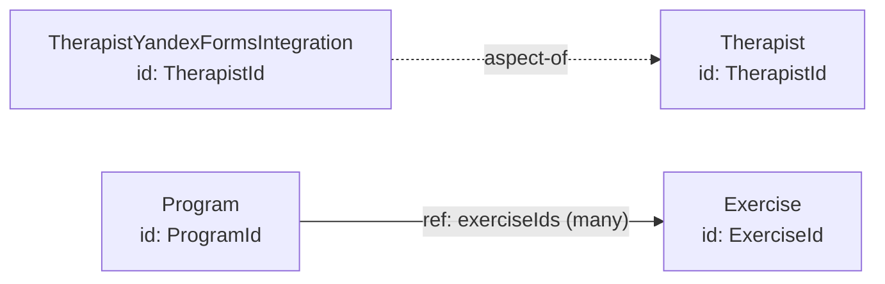

# Ergonomic Data Model

## 2. Concept spec: “Ergonomic Data Model”

### 2.1. Intention

The Ergonomic Data Model is used to design a system’s information model in a form that is convenient for implementing operations and evolving the codebase.
It replaces informal reasoning such as “how should we arrange fields and relationships” with verifiable constraints: explicit distinction between inclusion and association, an attribute budget, acyclicity of relationships, and decomposition of entities into base records and aspects.
The goal is to avoid monolithic entities with dozens or hundreds of fields and the resulting cascading changes, unnecessary loading, and tangled dependencies between modules.

### 2.2. Ontological status

The Ergonomic Data Model is a conceptual and logical model of information expressed as types of records, components, and relationships between them, plus a set of constraints on the allowed structure.
The model describes data identity, boundaries of “what is stored and changed together,” and the types of relationships between parts of information.
The model is not a physical storage schema and does not prescribe a specific DBMS, serialization format, ORM, or other persistence details.
It is not an object graph with arbitrary bidirectional references, nor is it a set of DTOs tailored to screens or API responses.
The practical artifact of the model is stored in two representations: a textual specification (for AI and validation) and a diagram (for people and discussions).

Operational distinction: if the artifact does not allow verification of the relationship type (`include|ref`), component attribute budgets, and acyclicity of the association graph, then it is not an Ergonomic Data Model.

### 2.3. Concept invariants

The Ergonomic Data Model remains an “Ergonomic Data Model” only if all statements below hold.

* **Records are units of data storage and modification.**
  Check: each record type has a root component and is treated as a whole when saved or modified.

* **A record is a tree of components with a single root.**
  Check: the record structure is defined by inclusion by value, not by a network of external references between internal components.

* **The root component of a record has an identifier.**
  Check: each record type defines an `id` field unique among records of that type.

* **Relationships between records are defined as associations by identifier.**
  Check: inter-record relationships are represented as references to the target record’s `id`, not by including the target record by value.

* **Inclusion and association are distinguished as different relationship types.**
  Check: each relationship in the model is classified as either `include` (nested component) or `ref` (reference to a record `id`).

* **The association graph is acyclic.**
  Check: a directed graph of `ref` dependencies between record types can be built and topologically sorted.

* **Components have an attribute count constraint.**
  Check: the model defines `component_fields_max`, and every component satisfies this budget.

* **An entity may be decomposed into a base record and aspect records sharing the same identifier.**
  Check: each aspect specifies an `anchor` (base record) and uses the same `id` type as the anchor.

### 2.4. Minimal notation

The minimal notation defines element types, relationship types, and required fields.
It is sufficient for an agent to build a model, verify invariants, and discuss changes without being tied to a specific visual diagram format.

#### Element types

* **Record (`Record`)** — a named data type stored and modified as a whole.
  Required fields: `name`, `id`, `fields`.
  Optional fields: `kind` (`base|aspect`), `anchor` (for `aspect`), `notes`, `trace`.

* **Component (`Component`)** — a named group of attributes within a record, included by value.
  Required fields: `name`, `fields`.
  Optional fields: `id` (only if the component must be referenced), `notes`, `trace`.

#### Relationship types

* **Inclusion (`include`)**: `Record|Component → Component`.
  Semantics: nested structure “by value.”

* **Association (`ref`)**: `Record|Component → Record`.
  Semantics: reference to a record by its `id`.

#### Canonical textual format (for AI)

```yaml
model: "<system/subsystem name>"

constraints:
  component_fields_max: 10 # default
  few:
    max_count: 20 # default
    max_wire_kib: 20 # default

components: # optional
  - name: PersonName
    fields:
      - { name: firstName, type: String }
      - { name: lastName, type: String }
      - { name: middleName, type: String }

records:
  - name: Therapist
    kind: base
    id: TherapistId
    fields:
      - { name: id, type: TherapistId }
      - { name: name, include: PersonName }

  - name: TherapistYandexFormsIntegration
    kind: aspect
    anchor: Therapist
    id: TherapistId
    fields:
      - { name: id, type: TherapistId }
      - { name: yandexAdminEmail, type: Email }

  - name: Exercise
    id: ExerciseId
    fields:
      - { name: id, type: ExerciseId }
      - { name: title, type: String }

  - name: Program
    id: ProgramId
    fields:
      - { name: id, type: ProgramId }
      - { name: exerciseIds, ref: Exercise, cardinality: many }
```

The fields `include` and `ref` are mutually exclusive for a single field.
The “few” threshold is defined by two constraints simultaneously: `<= few.max_count` elements and `<= few.max_wire_kib` KiB “over the wire.”
“Over the wire” means the size of serialized data crossing a process boundary when a record is read or transferred as a whole.

#### Derived visual representation (for people)

The textual model (YAML/JSON) is the source of truth.
The diagram is a derived representation and may be redrawn without changing meaning.

The default format for the derived visual representation is defined in `conventions/diagrams.md`.

Mermaid rendering rules:

* Render `Record` as a rectangle.
  Display record name and `id` type inside the node.
* Render `aspect-of` as a dashed arrow: `Aspect -. "aspect-of" .-> Base`.
* Render `ref` as a solid directed arrow `A --> B` labeled with the field name and cardinality if known.
* Render `include` inside the record node (e.g., as a list of included components/fields), without a separate record node.

Minimal Mermaid template:



### 2.5. Construction algorithm

1. Fix budgets and thresholds.
   Input: team and product constraints.
   Output: `component_fields_max` and the “few” threshold.
   Defaults: `component_fields_max=10`; “few” = no more than `20` elements and no more than `20` KiB over the wire.

2. Identify base records.
   Input: requirements, domain terms, API operations.
   Output: list of `Record(kind=base)` with `id` and minimal identification/search/creation fields.

3. Raise the level of abstraction via components.
   Input: base record fields and their semantic groups.
   Output: a set of `Component` types that reduce field count per component and make attribute groups cohesive.

4. Decompose entities into aspects.
   Input: system functions and usage contexts (screens, API methods, integrations).
   Output: `Record(kind=aspect)` with `anchor` and the same `id`, containing fields specific to particular functions.

5. Design relationships.
   Input: relationships between entities and lifecycle expectations.
   Output: `include` for “ownership + few” and `ref` for associations and high cardinalities.
   Heuristics:

   * “ownership + few” → `include`
   * “ownership + many” → separate record on the “many” side with `ref` to owner
   * “non-ownership” → `ref` by `id`
   * “N-M” → separate link record with two `ref` N-1 relationships

6. Break cycles and fix direction.
   Input: `ref` dependency graph.
   Output: DAG by removing convenient back-references, introducing link records, or reversing dependency direction based on stability.

7. Validate against operations.
   Input: list of operations and expected transactional data changes.
   Output: confirmation that typical operations modify a limited number of records, or model adjustments.

### 2.6. Common mistakes (anti-patterns)

* **Cycle in the association graph.**
  Detection: topological sort fails.
  Message: “Cycles turn into module dependency cycles and break decomposition.”
  Auto-fix: remove convenient back-reference unless required for invariants or operations.

* **Mixing inclusion and association.**
  Detection: field looks like value inclusion but semantically references an independent record, or vice versa.
  Message: “Explicitly decide whether this is part of the record (`include`) or a reference (`ref`).”
  Auto-fix: rewrite as `ref` and move data to a separate record if lifecycles are independent.

* **Component or record exceeds attribute budget.**
  Detection: field count exceeds `component_fields_max`.
  Message: “Large blocks reduce clarity, reuse, and loading efficiency.”
  Auto-fix: introduce higher-level component or move field group into an aspect.

* **Bidirectional references for navigation convenience.**
  Detection: both `A.ref(B)` and `B.ref(A)` exist.
  Message: “Navigation alone is not sufficient reason for a relationship and usually creates a cycle.”
  Auto-fix: keep one direction and obtain reverse side via query/view.

* **Many-to-many as lists on both sides.**
  Detection: both records contain `ref` collections without link record.
  Message: “This loses relationship attributes and leads to model sprawl.”
  Auto-fix: introduce link record and replace N-M with two N-1 relationships.

* **1-N ownership modeled as `include` of large collection.**
  Detection: included collection violates `constraints.few`.
  Message: “Large included collections bloat the record.”
  Auto-fix: move elements to separate record on “many” side with `ref`.

* **Aspect turned into a dumping ground.**
  Detection: aspect contains identification fields or accumulates unrelated data.
  Message: “Aspects should correspond to cohesive functions.”
  Auto-fix: split into multiple aspects; return identification fields to base record.

---

## 3. Skill spec: AI-agent usage of the “Ergonomic Data Model”

### 3.1. Usage triggers

The agent should suggest applying it if at least one holds:

* domain model is designed/refactored and entities grow large;
* cycles or bidirectional links appear;
* new function adds fields along with screen/API/integration;
* need to clearly separate “stored together” vs “referenced only.”

It should not suggest it for:

* pure computation without persistent state;
* DTO/representation formatting only.

### 3.2. Questions to the user

Asked in order; unknown answers marked `TBD`.

1. What component attribute budget (`component_fields_max`) do you accept? Default `10`.
2. What “few” threshold (`constraints.few`) do you accept? Default `<=20` elements and `<=20` KiB over the wire.
3. Which operations/screens/integrations read or write the entity, and which fields do they need?
4. Where are lifecycles strictly coupled (ownership) and where independent (association)?

### 3.3. Quality criteria

The model is “good enough” if:

* **Verifiability.**
  Textual artifact allows checking budgets and acyclicity.
* **Visualization.**
  Diagram exists and matches textual spec.
* **Explicit relationship types.**
  `include` and `ref` are distinguished and direction justified.
* **Controlled block size.**
  No uncontrolled growth without decomposition mechanism.
* **Operational alignment.**
  For typical operations, it is clear which records are read and changed together.

---
