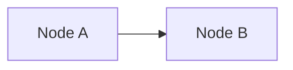

# Diagrams

## Mermaid by Default

In the framework documentation, diagrams are stored as text that is rendered into images.
Mermaid is used by default.

Exceptions are allowed if Mermaid lacks sufficient expressiveness or makes maintenance overly complex.
In such cases, the document must explicitly state the alternative format and the reason for using it.

## Derived Representations

If a concept has a textual specification (YAML/JSON/table), it is the source of truth.
The diagram is a derived representation and may be regenerated without changing the meaning.

## Mermaid Flowchart

For graph-based diagrams, use `flowchart LR` by default.
Node labels may use ` ` for line breaks.

Minimal template:

